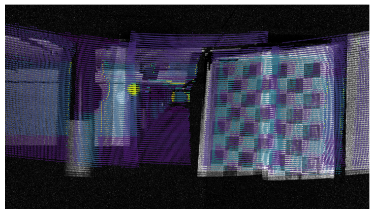

# L2E: Lasers to Events for 6-DoF Extrinsic Calibration of Lidars and Event Cameras

[[Paper]](https://ieeexplore.ieee.org/abstract/document/10161220) [[Arxiv]](https://arxiv.org/abs/2207.01009)

This repository contains the official code for the ICRA 2023 paper [L2E: Lasers to Events for 6-DoF Extrinsic Calibration of Lidars and Event Cameras](https://ieeexplore.ieee.org/abstract/document/10161220), a calibration process for event cameras and lidar via mutual information maximization.

**Uncalibrated Result**



**Calibrated Result**


## Abstract

As neuromorphic technology is maturing, its application to robotics and autonomous vehicle systems has become an area of active research. In particular, event cameras have emerged as a compelling alternative to frame-based cameras in low-power and latency-demanding applications. To enable event cameras to operate alongside staple sensors like lidar in perception tasks, we propose a direct, temporally-decoupled extrinsic calibration method between event cameras and lidars. The high dynamic range, high temporal resolution, and low-latency operation of event cameras are exploited to directly register lidar laser returns, allowing information-based correlation methods to optimize for the 6-DoF extrinsic calibration between the two sensors. This paper presents, L2E, the first direct calibration method between event cameras and lidars, removing dependencies on frame-based camera intermediaries and/or highly-accurate hand measurements.

## Usage

### Installing Dependencies

We provide two files for installing dependencies. To just run the optimization process, we can install requirements via `pip` . This was tested and collected in Python 3.8.10.

```bash
python3 -m venv venv
pip install -r requirements.txt
```

For the extraction script, the command-line tool uses has ROS dependencies which are typically set into the default Python path when you install ROS. These scripts were run with a ROS-Noetic installation. We also provide a Conda environment that can run the extraction script. This was tested & collected in Python 3.7.12.

```bash
conda create --name l2e --file environment.txt
```

### ROS Bag Extraction

[[Sample ROS Bag]](https://drive.google.com/file/d/1yOeh6oB30gYrakfRZU4Pxx3r9lyid7Uh/view?usp=sharing)

Our sample dataset was built with the following available sensors:

- **RS-LiDAR-M1** `/rslidar_points` An automotive-grade MEMS LiDAR that has a 120° HFoV and a 25° VFoV
- **Prophesee Gen4.1** `/prophesee/camera/cd_events_buffer` A state-of-the-art event-based camera

The above sensors were run via a ROS interface and their data collected into a rosbag with the associated rostopics. You can run the extraction script with the following command. Flags point to which sensor to extract.

```bash
python extract.py {path/to/bag_folder/} {path/to/output_folder} --event --lidar
```

The event image reconstruction is performed by accumulating events regardless of polarity to create an accumulated event map. Most triggered events in a static scene are induced by the lidar lasers as the event camera is sensitive to the 905 nm wavelength of light. This script will separate each of the sensor data into the folders `event` and `lidar` with the same stem name when extracted from the same bag.

You can use `--help` to get the doc string information regarding the extraction script. use `:q` to exit.

### Run Optimization

[[Sample Data]](https://drive.google.com/file/d/1QuxNBCBNYBv8LCTTewQFRE_vFg0PBBeS/view?usp=sharing)

or get the data by:

```bash
pip install gdown
gdown https://drive.google.com/uc?id=1QuxNBCBNYBv8LCTTewQFRE_vFg0PBBeS
unzip sample_data.zip
```

If you have post-extracted images and point clouds scans, you can also arrange them into the same format as the sample data.

Then the mutual information optimization can be run with the following command:

```bash
python optimize.py {path/to/images/} {path/to/lidar_scans/} {path/to/output_folder/}
```

Additional arguments / parameters include:

- `--bounded` flag for optimizing with bounds on seed values _(default True)_
- `--disp_bounds` max displacement difference from seed values in m _(default ±0.2 m, from seed)_
- `--deg_bounds` max rotation difference from seed values in degrees _(default ±5 degrees from seed)_
- `--optimizer` optimizer to use in _{'nelder-mead', 'Powell', 'L-BFGS-B', 'BFGS', 'CG', 'SLSQP'}_
- `--image_blur` gaussian blurring std on image to smooth optimization _(default 5px)_
- `--key` key for the intrinsic calibration in `config.json` _(default cam)_
- `--use_axis_representation` flag to use rotation vector over Euler angles _(default True)_
- `--calibrate_rotation_only` flag to only calibrate rotation (useful if CAD translations are trusted) _(default False)_

You can use `--help` to get the doc string information regarding the optimization script. use `:q` to exit.

## Citation

```bibtex
@inproceedings{kevinta2023:l2e,
  title = {L2E: Lasers to Events for 6-DoF Extrinsic Calibration of Lidars and Event Cameras},
  author = {Ta, Kevin and Bruggemann, David and Brödermann, Tim and Sakaridis, Christos and Van Gool, Luc},
  booktitle = {International Conference on Robotics and Automation (ICRA)}
  year = {2023}
}
```
